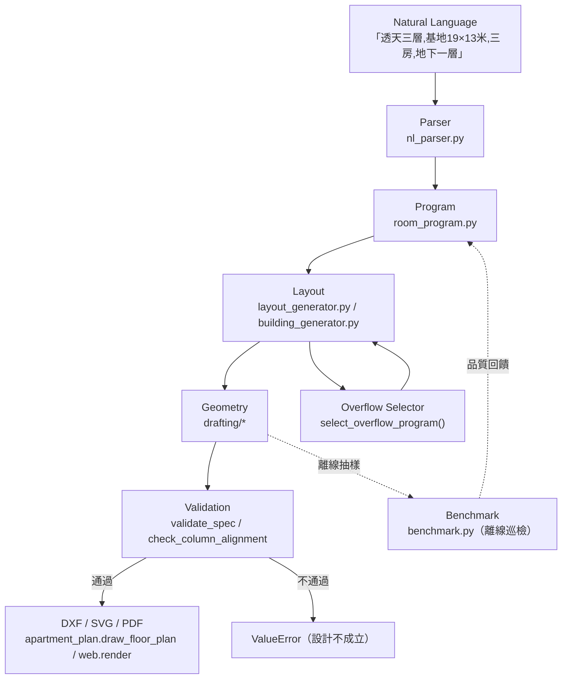

# Architecture Snapshot — v0.5 Beta

本檔畫出 v0.5 的完整資料流,並說明每個模組負責什麼。定位:**一句中文需求 →
完整平面圖 DXF**,中間經過解析 → 面積程式 → 佈局 → 幾何 → 溢位選擇 → 檢核 →
(巡檢)→ 出圖。

---

## 資料流



若不支援 mermaid,純文字版:

```
Natural Language
      ↓  nl_parser.py（Gemini 解析成結構化需求）
   Parser
      ↓  building_brief_from_data → HouseBrief / BuildingBrief
  Program
      ↓  room_program.py（面積分配 allocate_areas / 形狀 solve_band）
  Layout
      ↓  layout_generator._house_frame（骨架:帶深/軸網/x_lv 溢位切點）
      ↓  ┌─────────────────────────────┐
Overflow Selector  select_overflow_program()  →  書房/家庭廳/多功能/儲藏
      ↓  └─────────────────────────────┘
  Geometry
      ↓  drafting/*（牆/房間/門窗/家具/樓梯 → FloorPlanSpec）
  Validation
      ↓  validate_spec + check_column_alignment（不過就 raise）
  Benchmark（離線）        DXF / SVG / PDF
      ↓                        ↓
  report.html            AutoCAD / 瀏覽器 / 列印
```

---

## 各模組職責

### 1. Natural Language → Parser
**`src/design/nl_parser.py`**
- `parse_brief_data(text)` / `parse_modification_data(text, base)`:呼叫 Gemini,
  把中文需求(或修改指令)轉成結構化 dict(基地寬深、房數、樓層、地下室、
  方位、書房/孝親房/車位…)。強制 JSON schema。
- `building_brief_from_data(data, seed)`:dict → `HouseBrief`(單戶透天)或
  `BuildingBrief`(整棟)。透天多層/有地下室自動 `differentiated=True`。
- ⚠️ LLM 只負責**解析語意**,不決定格局;格局是規則引擎算的。

### 2. Program(面積程式)
**`src/design/room_program.py`** — **所有房間尺寸的唯一來源**。
- `RoomRequirement`:每種房間的 min/preferred/max 面積 + min_width/min_depth/
  aspect_max + priority。`ROOM_PROGRAM` 是那張表。
- `allocate_areas(kinds, budget, caps)`:加權水位法,把可用面積分配到各房間
  (全員到 min → preferred → max → 餘量退回)。
- `solve_band(targets, reqs, width_avail, depth_bounds)`:面積 → 帶進深 + 各格
  寬度(形狀由可用寬度決定)。
- `compact_width(depth, req)`:客廳守 aspect_max 的最大寬。
- `select_overflow_program(...)`:**Program Selector**——依脈絡決定溢位用途。

### 3. Layout(佈局)
**`src/design/layout_generator.py`**(單層/單戶)+ **`building_generator.py`**(整棟)。
- `_house_frame(brief)`:透天多樓層的**不變骨架**——外殼、南北帶深、東端
  濕區/樓梯間、軸網、以及 Living Overflow 切點 `x_lv`。各層共用 → 柱位對齊。
- `generate_house_public`(1F)/ `generate_house_upper`(2F+)/
  `generate_house_basement`(B1F):用骨架的刀位組出各層房間。
- `_generate_house`:單層單戶(兩帶式)。`_generate_corridor`:集合住宅。
- `generate_building(brief)`:標準層產一次、逐層組成 `BuildingSpec`。
- 產物是 `FloorPlanSpec`(牆/房間/門窗/家具/樓梯/軸網/柱)。

### 4. Overflow Selector(溢位選擇)
**`room_program.select_overflow_program` + `layout_generator._plan_overflow` /
`_add_overflow` / `_furnish_overflow`**。
- 客廳寬 > `aspect_max × 帶深` → 切溢位;Selector 決定用途;`_add_overflow`
  立牆 + 連通口 + 房間;`_furnish_overflow` 擺家具(貼南牆避開門)。

### 5. Geometry(幾何/畫圖元素)
**`src/drafting/*`**
- `wall.py` / `wall_join.py`:牆體、牆角接合、開口。
- `room.py`:房間多邊形、面積、標籤。
- `door_window.py`:門(開啟弧)、窗(雙/三線)。
- `fixtures.py`:家具/設備圖塊、流理台(Counter)、中島。
- `stair.py`:單跑直梯 + 中央扶手 / 折返梯。
- `members.py` / `gridlines.py`:柱、梁、軸網。
- `dim_chains.py` / `schedule.py` / `titleblock.py` / `annotations.py`:尺寸鏈、
  圖表、圖框、樓層字/北向箭頭。
- `apartment_plan.py`:`FloorPlanSpec` 資料模型 + `draw_floor_plan`(把上面
  全部串成一張圖)。

### 6. Validation(檢核)
**`layout_generator.validate_spec` + `building_generator.check_column_alignment`**
- `validate_spec(spec)`:房間不重疊/面積覆蓋/每房有門/臥室客廳有窗/開口不
  壓柱/動線(走道/臥室門)/採光深度/家具不撞不擋門/柱網規則性。
- `check_column_alignment(building)`:逐層比對柱心,上層柱要有下層支承。
- 生成器內建自動跑,不過就 `raise ValueError`——大量出圖、張張合格。

### 7. Benchmark(離線巡檢)
**`src/design/benchmark.py`**
- 34 案 × 五面向(生成/DXF/房間比例/動線/家具)量化,產 `report.html`。
- **不在生成主線上**——是工程用的巡檢台,跑一次看引擎哪裡歪。
- 品質發現回饋到 Program / Layout 的調整(如客廳 aspect_max)。

### 8. DXF / SVG / PDF(出圖)
- `apartment_plan.draw_floor_plan(msp, spec, layers)`:畫成 DXF。
- `src/standards/loader.py`:圖層標準(競賽圖層規定)。
- `src/web/render.py`:DXF → SVG(瀏覽器預覽)/ PDF(A3 圖冊)。
- `src/web/app.py`:FastAPI,把「中文 → 出圖」包成 HTTP 服務。

---

## 關鍵不變量(跨模組保證)

1. **柱網優先**:面積是「目標」不是「命令」,允許 ±10% 誤差;柱網/結構/牆線
   永遠優先(使用者定調)。
2. **各層同軸網**:多樓層共用 `_house_frame` 骨架 → 柱位天生上下對齊。
3. **單一來源**:房間尺寸只在 `room_program.py`;圖層只在 `standards`。
4. **生成即檢核**:每份 `FloorPlanSpec` 出廠前跑 `validate_spec`。
