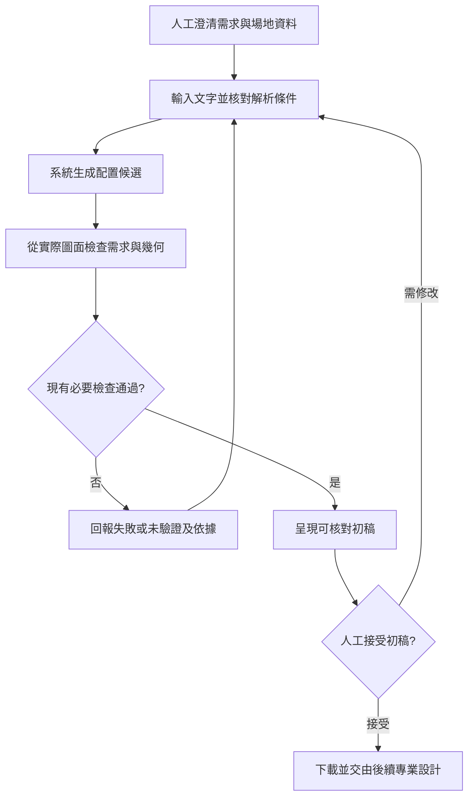

# 專題問題定義與人工設計流程

整理日期：2026-10-03。程式核對基準：`e321047`。本文是研究範圍與實作對照文件，不是使用者研究成果或效益驗證報告。

## 1. 一句話定義

協助使用者把文字住宅需求，轉成符合已實作需求、尺寸與動線檢查的透天住宅配置初稿，供人工核對、討論與修改。

建議專題名稱：**結合自然語言需求解析與幾何檢核的透天住宅配置初稿輔助系統**。

研究對象是從「需求文字」到「可檢查的配置候選」這一段工作。輸出有 DXF、PDF，不表示已完成結構、機電、施工細節或建照審查；RAG 與素描動畫是輔助功能，不是問題定義本身。

## 2. 誰在什麼情境使用

目前先以建築相關學生或初步配置人員作為目標操作者；需求提出者可提供文字及回饋，老師或具建築專業者協助判讀。這是本專題的使用者範圍設定，尚未經訪談確認。

使用情境：已知道住宅大致類型、可用尺寸、樓層及房間需求，希望先取得可討論的配置，查看條件是否落在圖面上，再調整需求。使用者應能辨認「基地尺寸」與「建築尺寸」，並核對解析結果。

核心任務不是讓使用者自行完成整棟建築設計，而是協助完成一次「提出需求—取得候選—核對—修改」的初稿循環。

## 3. 問題本質與待證實的痛點

文字需求和圖面之間有三種不同工作，不能只用模型產生的說明代替：

| 工作 | 需要解決的問題 | 本系統採取的方式 |
|---|---|---|
| 需求澄清 | 「四房」是否必須剛好四間？尺寸是土地還是建築？ | 解析成欄位，保留原句、必要／偏好及比較方式；再讓人核對 |
| 空間配置 | 有限範圍內如何安排房間、樓梯、門窗與家具？ | 在現有骨架或關係圖配置方式內生成候選，落實為幾何 |
| 一致性檢查 | 生成結果是否真的滿足要求、房間能否連通？ | 從最終配置重新量測、清點及檢查；未通過則保留診斷 |

本專題待確認的痛點假設是：初稿反覆調整時，需求記錄、配置生成與結果核對之間可能出現遺漏或不一致。必須透過實際案例了解哪些步驟經常重做、原因為何，不能直接宣稱傳統流程效率低、人工容易出錯，或本系統已經節省時間。

系統目前可驗證的是「程式是否按已定義規則處理」，尚未證明的是「使用者是否因此更快得到可接受初稿」。兩者應分開回答。

## 4. 原本由人怎麼完成

AIA 的服務流程說明把需求確認、空間關係及初步圖面放在方案設計階段，後續還有設計深化與施工文件。本專題據此把工作邊界放在初稿階段。[AIA：Defining the architect’s basic services](https://www.aia.org/resource-center/defining-the-architects-basic-services)

RIBA 的工作計畫亦區分需求、設計、施工與使用等階段，支持「只協助其中一段工作」的定位。[RIBA：Plan of Work](https://www.riba.org/work/insights-and-resources/riba-plan-of-work/)

以下是為本專題整理、待實務訪談修正的七步流程。它不是對所有事務所的實測描述，也不是臺灣建照程序或法規清單；手繪、CAD、BIM 等工具選擇仍須向受訪者確認。

| 步驟 | 人工要作的決定 | 應留下的資料 | 系統現在協助的部分 | 仍由人負責 |
|---|---|---|---|---|
| 1. 澄清需求 | 誰居住、需要哪些空間、哪些條件可退讓 | 訪談紀錄與需求表 | 文字解析、必要／偏好記錄 | 查漏、澄清含糊語句及確認優先序 |
| 2. 確認場地與限制 | 邊界、入口、開窗條件及其他現場限制 | 尺寸與限制依據 | 接受簡化尺寸、套用現有配置假設 | 現勘、核對真實地籍與適用限制 |
| 3. 整理空間需求 | 房間用途、數量、樓層與關係 | 空間清單、關係草圖 | 房數與用途欄位、既有區塊分配 | 生活習慣、必要關係及衝突取捨 |
| 4. 提出配置候選 | 公私分區、樓梯、房間、出入口如何安排 | 配置草圖與候選方案 | 規則骨架／模型選配／關係圖提案及幾何落實 | 判斷比例、舒適性與情境適合度 |
| 5. 核對候選 | 需求、尺寸、出入與家具是否合理 | 核對表與退回原因 | 已實作的需求量測、幾何與動線檢查 | 系統未涵蓋的設計、工程及完整規範判斷 |
| 6. 討論與修改 | 接受哪些調整，哪些條件仍必須保留 | 修改前後版本與原因 | 修改需求、重生候選並重新核對 | 確認取捨與是否接受初稿 |
| 7. 整理初稿供後續工作 | 圖面是否足以討論與接續設計 | 初稿圖面及待解問題 | DXF／PDF、需求報告與空間分析 | 後續專業設計、協調、審查及施工文件 |

「人工接受」是本文建議的工作流程判斷點，目前不是網站新增的接受按鈕；系統通過和人工接受不能互相替代。

## 5. 明確定義輸入、輸出和成功

**輸入：** 文字需求，以及使用者能確認的尺寸基準、樓層、臥室、車位與其他受支援條件。參考文件或網址是選用資料，不是生成初稿的必要輸入。未填的條件要核對系統預設，不應當成使用者已確認。

**輸出：** 成功時為配置初稿、逐項需求核對、現有檢查結果及可用的空間分析／下載檔；失敗時為未滿足、未驗證或本次生成未找到可交付候選的原因。失敗不等於已證明所有設計方法都無解。

**程式交付條件：** 已辨識並記錄的必要需求均滿足，且最終現有檢查通過，才把本次候選當成成功初稿。偏好可以未達成，但必須保留結果。自由文字未被辨識成需求的部分，不能據此宣稱也已核對。

**人工接受條件：** 操作者核對原始需求與圖面後，認為這份初稿足以進入下一輪討論或專業設計。接受依據和未決問題要記錄，不能以「圖片已生成」或單一評分取代。

從計算角度，可把配置候選理解為房間多邊形、用途、樓層、門窗及家具的集合。系統先確認已實作的必要限制，再在可用候選中使用現有評分輔助選擇；目前不是任意形狀、任意需求的通用最佳化求解器，也不保證全域最佳解。

## 6. 必要條件、偏好與尚未驗證事項

| 類別 | 例子 | 處理原則 |
|---|---|---|
| 必要條件 | 三層、剛好四房、可用建築寬深上限 | 不能為提高分數偷偷刪除；從最終圖面重查 |
| 偏好 | 最好有天井 | 只有使用者允許退讓才作偏好；未滿足需顯示 |
| 程式硬規則 | 已實作的門、碰撞、連通及尺寸檢查 | 不由模型文字或高分抵銷失敗 |
| 待人工確認 | 基地真實條件、生活適合度、完整專業審查 | 不用既有檢查通過替代 |
| 尚無可靠量測 | 超出支援範圍的自由文字或功能要求 | 已辨識者應顯示未驗證；未辨識者需人工補核 |

必要／偏好表示需求的優先性；可否量測表示系統能力。必要要求不會因為難以實作就自動變成偏好。

## 7. 與目前程式的對照

| 分工 | 程式入口 | 能據此說明什麼 |
|---|---|---|
| 語言解析與需求保存 | [nl_parser.py](../src/design/nl_parser.py)、[requirements.py](../src/design/requirements.py) | 語句轉欄位、原句與必要／偏好、eq/min/max 及最終需求核對 |
| 配置生成與房數分配 | [building_generator.py](../src/design/building_generator.py)、[bedroom_program.py](../src/design/bedroom_program.py)、[graph_layout.py](../src/design/layout/graph_layout.py) | 不同配置路徑；精確房數分配限於受支援的既有區塊 |
| 幾何與檢查 | [validation.py](../src/design/validation.py)、[connectivity.py](../src/design/connectivity.py)、[spatial_report.py](../src/design/spatial_report.py) | 實際配置的檢核、連通圖及空間報告，不是事後由 LLM 編造的理由 |
| 文字參考檢索 | [rag.py](../src/knowledge/rag.py) | 384 維 E5 語意向量用於文字檢索，不代表房間座標 |
| 呈現與交付 | [app.py](../src/web/app.py)、[index.html](../src/web/static/index.html) | 網頁核對、修改、圖面與下載；不是 CAD 拖牆編輯器 |

詳細計算與限制見 [需求核對](REQUIREMENTS.md)、[空間推理](SPATIAL_REASONING.md)、[RAG](RAG.md)。

能力邊界須一併報告：車位數是圖面汽車配置計數，不驗證轉彎軌跡；房間間的 BFS 是拓撲連通，不是實際步行距離或完整逃生計算；採光通風採現有簡化檢查；資料匯入是文字擷取，不是圖面幾何辨識。

部署狀態另計：2026-09-30 的 Render 驗證曾成功保存三份網頁來源，但向量索引未就緒；這是上次觀察，不是 2026-10-03 重新驗收。本文整理不會啟用線上索引，也不宣稱 RAG 效益。

## 8. 用一個情境說明問題

以下為**說明用假設案例**，不是業主訪談、真實住宅案例或本次執行結果。

原始描述：「透天三層，建築物 4.5×14 米，四房，最好有天井。」

人工先確認 4.5×14 指建築可用範圍、四房指精確臥室數，以及天井可退讓。接著提出樓層及房間配置，檢查尺寸與動線，再與需求提出者討論。

系統對應的可檢查事項是：樓層為三層、實際臥室數為四間、建築軸線外框不超出可用寬深，並通過現有檢查；天井另顯示偏好結果。尺寸上限核對不等於精確畫滿 4.5×14 米，也不代表已核准基地使用。

如果目前骨架無法安排四間合格臥室，正確回應是保存四房要求並說明這次失敗，不能交付三房卻標示成功。若程式檢查通過，但使用者覺得房間比例不適合，仍應進入人工修改，不把程式分數當成接受意見。

## 9. 如何補上真正的人工流程證據

使用 [人工設計案例訪談與紀錄表](DESIGN_WORKFLOW_CASE_TEMPLATE.md)，先記錄一個有資料使用許可的實際初稿案例，訪談實際操作的人。保留匿名案例代號、需求原句、圖面版本、決策原因與資訊來源。

優先問：「收到需求後第一步做什麼？」「哪些資料缺少就不能畫？」「哪次修改牽動最多地方？」「如何判斷初稿可接受？」請對方用具體版本說明，而不是只問是否喜歡 AI。

待取得資料後，再確認前述痛點是否存在、系統是否涵蓋該步驟。此階段不做方法比較，不填寫臆測工時、改善百分比或使用者滿意度，也不把單一案例推廣為整個業界。

AIA 的品質管理指引強調先說清楚階段目標、交付內容及其用途；本文將其轉為案例紀錄時的核對項目。該指引原以中大型商業專案為背景，不能直接當作透天住宅的完整檢查清單。[AIA：Schematic design phase quality management](https://www.aia.org/resource-center/schematic-design-phase-quality-management)

## 10. 可直接向老師說明的版本

> 老師，我把問題範圍收斂在「透天住宅從文字需求到可核對配置初稿」這一段。人工流程需要先澄清需求與場地限制，再提出配置、檢查並反覆修改。我想協助的是需求轉換、候選配置及結果核對，專業設計判斷仍由人負責。
>
> 程式會把已辨識的必要條件與偏好分開，LLM 負責語言解析及配置提案，幾何程式負責落實座標與檢查，再從最終圖面核對房數等要求。RAG 用於查有來源的文字，不負責證明幾何成立。現有檢查通過只表示通過我們已實作的範圍，不代表可直接施工。
>
> 目前我先完成問題定義、人工流程與程式分工對照；下一步會用實際案例確認真正反覆修改的原因。我還不能宣稱已節省時間或比人工更好。
